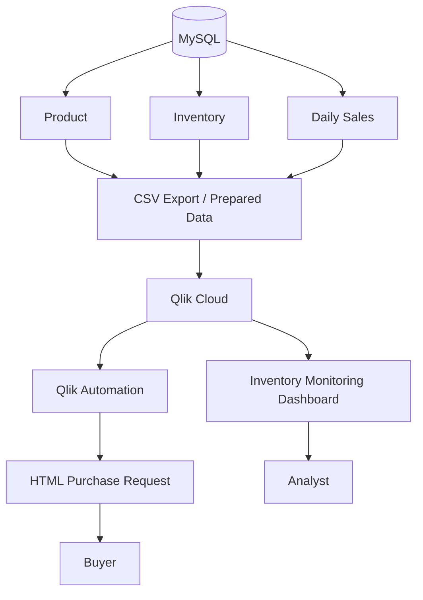

# StockGuard — Intelligent Inventory Monitoring


> Portfolio project built with fictional demonstration data to show how operational inventory data can be transformed into monitoring, prioritization, and automated action.

## Overview

**StockGuard** is an inventory monitoring solution developed in **Qlik Cloud**. The project goes beyond showing current stock levels: it estimates stock coverage in days, classifies each product by risk level, and connects critical conditions to an automated purchase-request workflow.

The core idea is simple:

```text
Sales + Inventory Data
        |
        v
Stock Coverage Calculation
        |
        v
Risk Classification
        |
        v
Qlik Dashboard
        |
        +--> Attention -> Analyst monitoring
        |
        +--> Critical -> Qlik Automation -> Purchase Request E-mail
```

## Business problem

Looking only at available quantity can be misleading. A product with 300 units in stock may look safe, but if it sells 100 units per day, it only has three days of coverage.

StockGuard therefore uses the relationship between current stock and average daily sales to identify replenishment risk earlier.

## Main business rule

The main metric is:

```text
Stock Coverage (days) = Current Stock / Average Daily Sales
```

The demonstration thresholds are:

| Status | Coverage rule | Meaning | Action |
|---|---:|---|---|
| 🟢 Healthy | > 7 days | Comfortable stock level | Normal monitoring |
| 🟡 Attention | > 3 and <= 7 days | Preventive risk | Analyst follow-up |
| 🔴 Critical | <= 3 days | High stockout risk | Automated purchase request |

The thresholds are demonstration rules and can be parameterized for a real operational policy.

## Dashboard

The operational dashboard focuses on quick prioritization.

### Main indicators

- Products monitored
- Healthy products
- Products requiring attention
- Critical products

### Main analyses

- Inventory-status distribution
- Ranking of products with the lowest coverage
- Operational priority queue with product, category, brand, current stock, average daily sales, coverage days, and status


## From analytics to action

The differentiator of the project is that the process does not stop at the dashboard.

Products classified as **Attention** remain visible for analyst monitoring. Products classified as **Critical** can trigger a Qlik Automation workflow that retrieves the relevant table data and sends a consolidated purchase-request e-mail to the buyer.


### Automated purchase request

The e-mail consolidates the critical products into a single communication and includes information such as:

- Product ID
- Product name
- Category
- Brand
- Current stock
- Average daily sales
- Coverage in days
- Status


The HTML template used for this message is documented in [`automation/purchase-request-email.html`](automation/purchase-request-email.html).

## Data architecture

The first version uses a local **MySQL** database for generation, storage, and validation of the demonstration data.



Because the MySQL instance is local, this portfolio version does not claim a direct live MySQL-to-Qlik Cloud connection. The current portfolio flow can use exported files for Qlik Cloud ingestion. A future evolution is **Qlik Data Gateway — Direct Access**.

See [Architecture](architecture/README.md).

## Relational model

The demonstration database contains three main tables:

- `produto` — product master data
- `venda_diaria` — daily sales history
- `estoque` — current inventory position

The stock-coverage rule was validated in MySQL before being implemented in the analytical layer.

See [SQL Validation](sql/README.md).

## Automation

The automation flow represents the action layer of the project:

```text
Critical product identified
        |
        v
Qlik Automation
        |
        v
Retrieve product information
        |
        v
Build HTML message
        |
        v
Send e-mail
        |
        v
Buyer
```

See [Automation](automation/README.md).

## Technologies

| Layer | Technology |
|---|---|
| Demo data generation / export | Python |
| Relational storage and validation | MySQL |
| Analytics | Qlik Cloud / Qlik Sense |
| Business logic | Qlik expressions and metrics |
| Automation | Qlik Automation |
| Notification layout | HTML / CSS |

## Demonstration dataset

The portfolio dataset is fictional and was created specifically for the project. It includes:

- 30 products
- 30 days of sales history per product
- Current stock by product
- Minimum stock by product

## Why this project matters

StockGuard was designed to demonstrate that BI does not have to end at visualization.

```text
Data
  |
  v
Information
  |
  v
Insight
  |
  v
Alert
  |
  v
Action
```

The project combines **data modeling, SQL validation, Qlik analytics, business rules, operational prioritization, and automation** in one small end-to-end use case.

## Future improvements

Potential next steps include:

- Qlik Data Gateway direct connectivity
- Parameterized coverage thresholds
- Buyer assignment by product category
- Alert history
- Purchase-order tracking
- Demand forecasting
- Supplier lead-time analysis
- Automated replenishment quantity suggestion
- Stockout-avoidance monitoring
- Automation-efficiency KPIs

## Repository structure

```text
.
├── README.md
├── architecture/
│   └── README.md
├── automation/
│   ├── README.md
│   └── purchase-request-email.html
├── sql/
│   └── README.md
└── screenshots/
    ├── README.md
    ├── 01-stockguard-dashboard.png
    ├── 02-purchase-request-email.png
    └── 03-qlik-automation-flow.png
```

---

**Portfolio project by Luiz Felipe Nunes — BI Developer | Qlik | SQL | Data Analytics**
