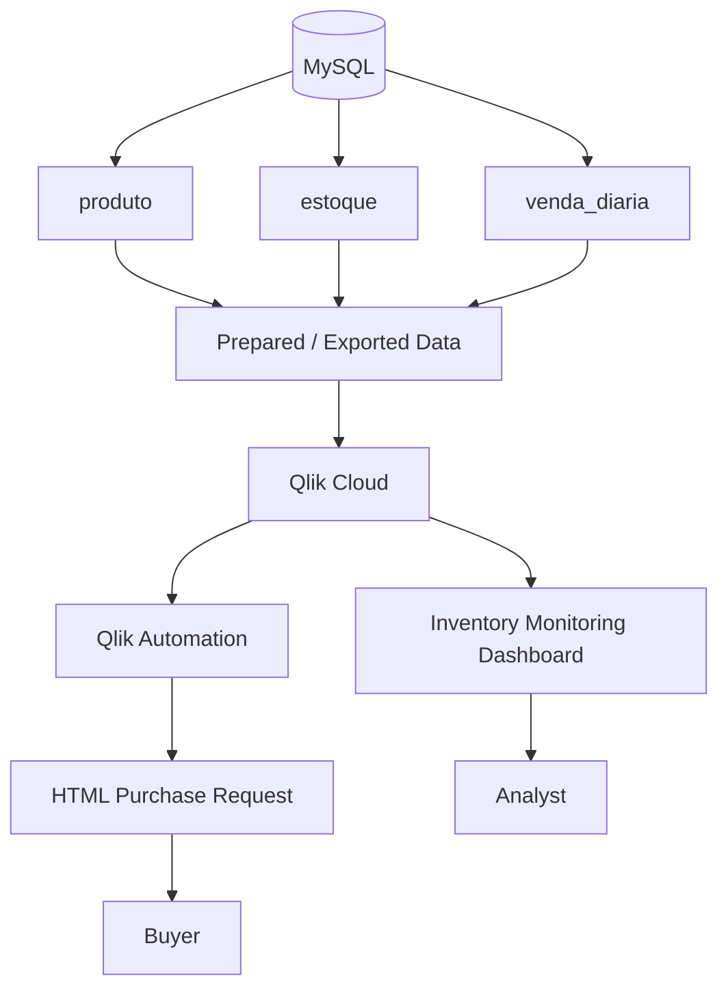

# Architecture

## Overview

StockGuard combines a small relational data layer, Qlik Cloud analytics, and an automation layer for operational action.

The first portfolio version uses a local MySQL database for generation, storage, and validation of the demonstration data.

## Current portfolio flow



## Data layer

The database contains three primary tables:

- `produto` — product registration and descriptive attributes;
- `estoque` — current inventory position and minimum stock;
- `venda_diaria` — daily sales history used to calculate average consumption.

## Analytical layer

Qlik Cloud uses the prepared data to calculate and present:

- current stock;
- average daily sales;
- stock coverage in days;
- risk classification;
- status distribution;
- lowest-coverage ranking;
- operational priority queue.

## Action layer

The project separates two types of operational response:

- **Attention** — remains visible for analyst monitoring;
- **Critical** — can trigger Qlik Automation and generate a purchase-request e-mail.

## Connectivity note

The MySQL instance is hosted locally in this portfolio version and is not presented as a live direct Qlik Cloud connection.

The portfolio flow can use exported data for ingestion into Qlik Cloud. A future evolution is to use **Qlik Data Gateway — Direct Access** for controlled connectivity between the local environment and Qlik Cloud.

## Design principle

The solution is intentionally designed around the progression:

```text
Data -> Information -> Insight -> Alert -> Action
```

This keeps the project focused on operational decision support rather than visualization alone.
